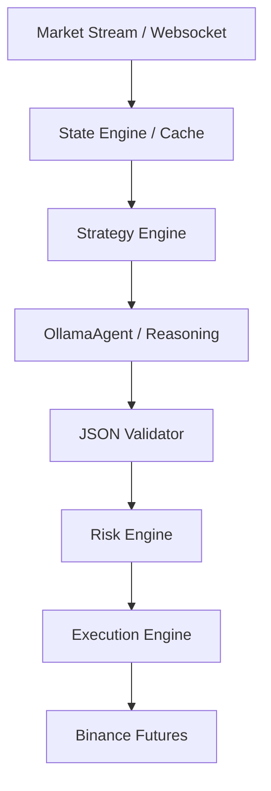

# TradingAgent Design Plan

## Overview
`trading_agent` is a production-grade Ruby framework for building autonomous trading agents. It uses `ollama_agent` as its "Reasoning Layer" (LLM Orchestration) while maintaining a deterministic, event-driven runtime for market data, risk management, and execution.

## Core Principles
1. **LLM as Advisor, Not Executor**: The LLM emits structured "Trade Intents". It never touches the exchange directly.
2. **Deterministic Guardrails**: All trade intents must pass through a Risk Engine that enforces hard limits (leverage, drawdown, position size) that the LLM cannot override.
3. **Event-Driven Architecture**: Uses an internal event bus to handle market ticks, order updates, and state changes to avoid race conditions.
4. **Local State Source of Truth**: Maintains a synchronized local cache of positions, balances, and candle data.

## Architecture



## Directory Structure (Proposed)
```
trading_agent/
├── lib/
│   ├── trading_agent/
│   │   ├── runner.rb              # Main loop orchestrator
│   │   ├── event_bus.rb           # Internal pub/sub
│   │   ├── exchanges/
│   │   │   ├── base.rb
│   │   │   └── binance_futures.rb # Uses binance-connector-ruby
│   │   ├── market/
│   │   │   ├── state.rb           # Local cache (positions, candles)
│   │   │   └── indicators.rb      # Technical indicators
│   │   ├── risk/
│   │   │   └── engine.rb          # Guardrails & Position Sizing
│   │   ├── execution/
│   │   │   └── manager.rb         # Order lifecycle management
│   │   └── llm/
│   │       ├── orchestrator.rb    # Wraps OllamaAgent
│   │       └── tool_registry.rb   # Trading-specific tools for LLM
├── spec/                          # RSpec tests
├── exe/
│   └── trading_agent              # CLI runner
├── Gemfile
└── trading_agent.gemspec
```

## Implementation Phases

### Phase 1: Deterministic Foundation (The "Engine")
- [ ] Scaffold gem structure.
- [ ] Implement `Exchanges::BinanceFutures` using `binance-connector-ruby`.
- [ ] Implement `Market::State` to track prices, candles, and positions.
- [ ] Implement `EventBus` for internal communication.
- [ ] Implement `Risk::Engine` with basic drawdown and leverage guards.

### Phase 2: Reasoning Layer (The "Brain")
- [ ] Integrate `ollama_agent` in `Llm::Orchestrator`.
- [ ] Define JSON schemas for Trade Intents.
- [ ] Implement trading tools for the LLM (e.g., `fetch_market_context`, `check_indicators`).
- [ ] Implement a `Strategy::Base` that triggers LLM evaluation on specific market conditions.

### Phase 3: Execution & Safety (The "Hands")
- [ ] Implement `Execution::Manager` to handle order placement, SL/TP, and trailing stops.
- [ ] Add emergency kill-switch logic.
- [ ] Implement comprehensive logging and telemetry.

### Phase 4: Refinement & Testing
- [ ] Add RSpec tests for all components.
- [ ] Create example strategies (e.g., Trend Following, SMC).
- [ ] Documentation and CLI usage.

## Integration with ollama_agent
`trading_agent` will use `ollama_agent` as a dependency.
The `Llm::Orchestrator` will initialize an `OllamaAgent::Runner` with a specialized system prompt and a set of `trading_agent` specific tools.

Example:
```ruby
# In TradingAgent::Llm::Orchestrator
@agent = OllamaAgent::Runner.build(
  model: "qwen2.5:14b",
  system_prompt: File.read("prompts/trading_expert.md")
)
```
